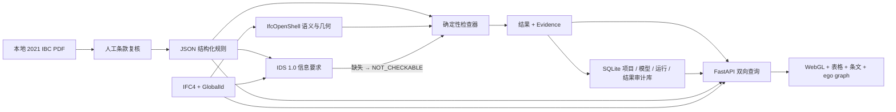
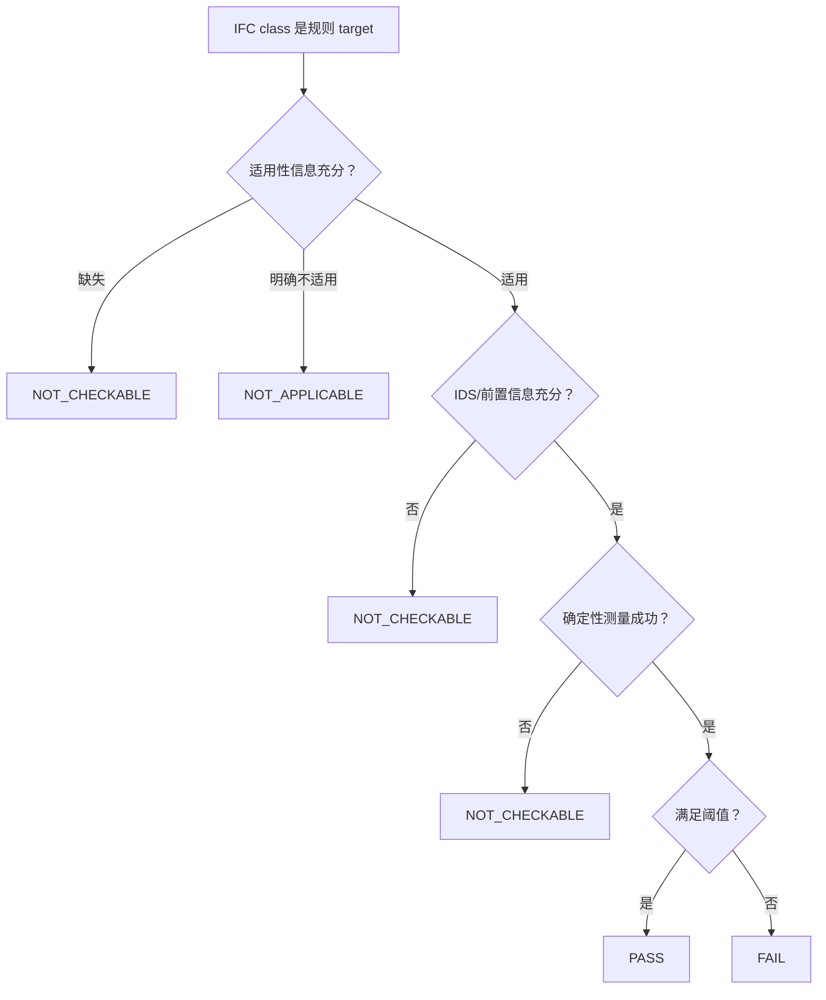

# 架构

## 设计目标

系统必须让结果从两个方向都能追踪，并保持三类职责分开：

1. IDS 回答“检查所需的信息在不在、类型对不对”。
2. 确定性检查器回答“在已知适用且信息充分时，阈值是否满足”。
3. 查询与界面回答“某条规则影响哪些构件、某个构件为什么被哪些规则检查”。



## 运行时组件

| 组件 | 责任 | 不承担的责任 |
|---|---|---|
| `rules.py` | JSON Schema 校验、规则索引 | 不执行规范逻辑 |
| `ifc_adapter.py` | IFC 属性、placement、三角网格、世界坐标 bbox | 不决定适用性 |
| `engine.py` | 适用性、信息前置条件、测量、状态和证据 | 不解释未建模例外 |
| IfcTester | 对 `.ids` 执行 buildingSMART IDS 1.0 验证 | 不判断 IBC 阈值 |
| `graph.py` | 构造局部关系投影 | 不存完整 B-rep |
| `api.py` | 双向 API 和静态界面托管 | 不包含规则算法 |
| `storage.py` | 自动迁移 SQLite，持久化项目、模型、运行和逐项结果 | 不保存 IFC 几何或重新判定合规 |
| `nl_query.py` | 中英文解析、Pydantic DSL 校验和确定性 domain query | 不生成 SQL，不调用 LLM，不决定新合规状态 |
| `exports.py` | 从已审计运行生成 JSON、CSV、HTML 和 BCF 3.0 | 不重新执行 checker，不嵌入 IFC |
| `frontend/` | 协调选择、筛选、三维拾取和解释 | 不在浏览器重新判定合规 |

## 数据主键

IFC `GlobalId` 是跨检查器、API、表格、三维网格和关系图的主要标识。规则使用稳定 `rule_id`。结果主键在 MVD 中等价于 `(execution_id, rule_id, element_guid)`。

`execution_id` 由 IFC 文件字节、规范化规则库和检查器版本的 SHA-256 摘要产生。相同输入得到相同执行号，便于比较重复运行。

每次实际执行另有唯一 `run_id`。相同输入的两次检查共享确定性 `execution_id`，但各自保留开始时间、耗时、状态计数和逐项证据。默认数据库位于被 Git 忽略的 `data/runtime/`，启动时自动执行 `schema_migrations`。

## 本地化

静态和动态 UI 文案使用 `frontend/i18n.json` 的 `zh-CN` / `en` 对等键集合。语言优先级为 URL `lang` 参数、浏览器本地保存值、浏览器首选语言；选择会写回 URL 和本地保存值。IFC `Name`、property key、IFC class 和带 `lang="en"` 的法规源文本保持源语言，不做伪翻译。

## 自然语言查询

`NaturalLanguageQueryRequest` 最多 500 字符，解析为禁止额外字段的 `QueryDSL`。DSL 只允许 `find_results`、`explain_element`、`summarize_results`，并在固定的 rule id、GlobalId、状态和 IFC class 上筛选。模糊输入 fail closed，不退化成全部结果；逐次查询审计写入 SQLite schema v2。

## 状态机



## 几何检查

受控 `IfcSpace` 夹具由正交 `IfcExtrudedAreaSolid` 构成。IfcOpenShell 把表示转换为世界坐标三角网格，检查器计算：

```text
height_mm = (max(vertex.z) - min(vertex.z)) × 1000
```

演示模型的项目长度单位是毫米，API 场景统一转换为米。算法保存 bbox、顶点数、三角形数和受控夹具假设。任意斜顶、阶梯空间和局部障碍不能套用这个简化量，应转入更丰富的几何算法或人工复核。

## 关系投影

MVD 在内存中从规则与结果按需建立 ego graph，没有引入数据库运维：

```text
Clause FORMALIZED_AS Rule
Rule APPLIES_TO IfcElement
Rule PRODUCES ComplianceResult
ComplianceResult EVIDENCED_BY IfcElement
```

接口形状保留 `nodes` / `edges`，后续可将相同投影写入 Neo4j；真实三角网格仍留在 IFC/IfcOpenShell 层。
